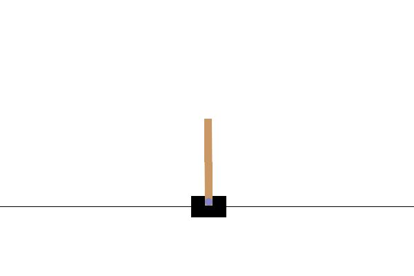

# MuZero-rs - Optimized and parallel MuZero in Rust

This project is based on the [MuZero](https://arxiv.org/abs/1911.08265) paper by DeepMind.
The main problem of Reinforcement Learning (RL) in many cases is skill issue. RL algorithms
can have astronomical training speedup by not using naive Python implmenetations. That is why
this program is written in Rust.

# Prerequisites

## sdl2_gfx

This is requried for CartPole to work.

Arch:
```bash
sudo pacman -S sdl2_gfx
```

Mac:
```bash
brew install sdl2_gfx pkgconf
```

## AMD path variables

Only needed if using rocm backend.

```bash
export ROCM_PATH=/opt/rocm
export HIP_PATH=/opt/rocm
export HSA_OVERRIDE_GFX_VERSION=11.0.0
```

## Training

The available backends are listed in [config.yaml](configs/config.yaml).

```bash
cargo run -r -p mz-train --bin train --features YOUR_BACKEND
```

## Othello in the browser

`crates/mz-web` compiles the inference half of the project (`crates/mz-core`) to
wasm and plays Othello against you with a minimal Gumbel MuZero search. The
trained weights are embedded in the wasm binary, so the site is fully static.

```bash
# 1. Export the checkpoint: writes crates/mz-web/assets/{othello.bin,net_config.rs}
cargo run -r --bin export_web            # optional arg: checkpoint path without extension

# 2. Build the wasm package
rustup target add wasm32-unknown-unknown
cargo install wasm-pack
wasm-pack build crates/mz-web --target web --out-dir web/pkg

# 3. Serve it (WebGPU needs localhost or https)
python3 -m http.server -d crates/mz-web/web 8080
```

The default build runs on WebGPU. For browsers without it, or for a much smaller
binary (1.5 MB instead of 8.5 MB) and faster batch-of-1 inference, build the
pure-Rust SIMD CPU backend instead:

```bash
wasm-pack build crates/mz-web --target web --out-dir web/pkg \
    --no-default-features --features flex
```

The wasm search is pinned to the training search by a parity test:

```bash
cargo test -p mz-web --no-default-features --features ndarray
```

# Result

After running the parallel training for a few minutes on a M2 Pro mac, the agent learns to play CartPole perfectly.


